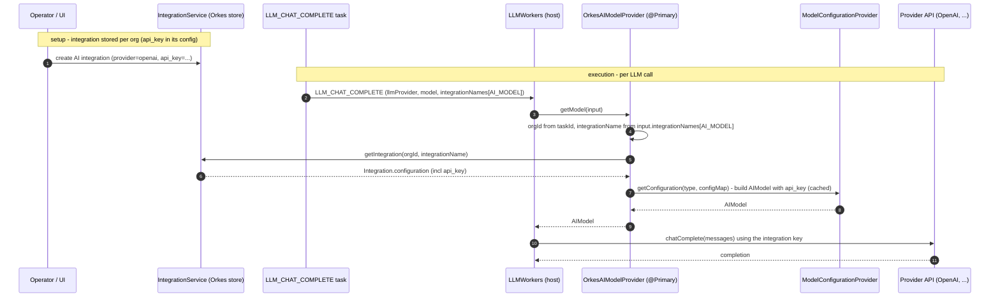
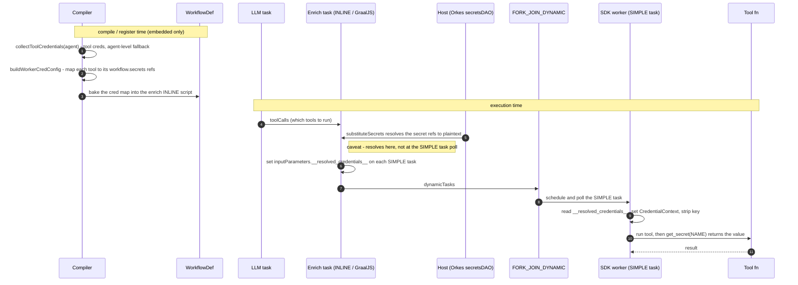
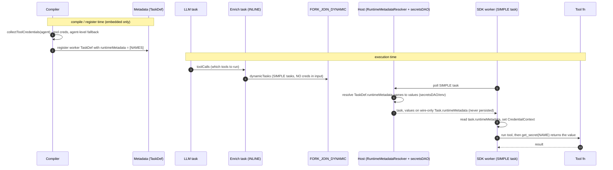
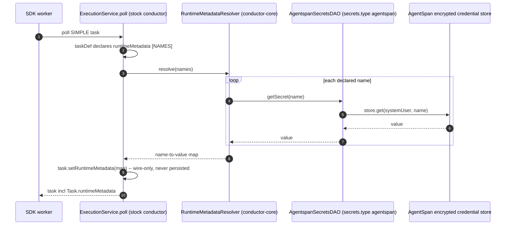
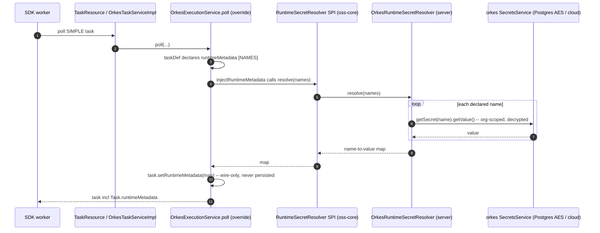

# Secret delivery toggle: native (standalone) vs host-delivered (embedded)

**Date:** 2026-07-09 (updated 2026-07-10) · **Status:** interim shipped (PR #307); target done + validated e2e (PR #311) · **Branches:** `feature/embedded-secret-toggle` (interim), `feature/embedded-secret-taskdef-target` (target)

## Summary

AgentSpan keeps its full native credential mechanism and toggles it with one flag, `agentspan.embedded`:

| Deployment | `agentspan.embedded` | Secrets |
|---|---|---|
| **Standalone** agentspan server | `false` (default) | **Native**: encrypted store, execution-token minting, `/api/workers/secrets` pull, SDK fetchers. Unchanged from `main`. |
| **Embedded** in orkes-conductor / conductor-oss | `true` | **Native dormant** (beans gated off); the **host** resolves secrets. |

Nothing is deleted — the native code stays intact for standalone.

## How secrets are delivered when embedded (split by task type)

- **Worker tools (SIMPLE, polled by the SDK)** → the worker's `TaskDef.runtimeMetadata` declares the
  secret names; the host resolves them at poll and injects the values onto the **wire-only
  `Task.runtimeMetadata`**. This is the **target**. Until the client SDKs expose that field (see
  table), we ship an **interim**: the compiler stamps
  `inputParameters.__resolved_credentials__ = {NAME: "${workflow.secrets.NAME}"}` and the host
  resolves it — same delivery, but it rides in the task-input `Map` that today's clients already keep.
- **LLM provider keys → the host's AI integration** (not a workflow secret). The `LLM_CHAT_COMPLETE`
  task resolves its model — and its API key — from the configured AI integration by provider name;
  agentspan stamps nothing. See the sequence below. (We deliberately do **not** map a provider to a
  conventionally-named workflow secret — that would duplicate and can conflict with the integration.)
- **HTTP / MCP / planner-context headers → `${workflow.secrets.NAME}`.** These are the *user's*
  external-API secrets (not integration-managed). The compiler rewrites a `${NAME}` placeholder in a
  header to `${workflow.secrets.NAME}` (embedded) and the host substitutes it in memory before the
  in-process call. Same for target and interim.

### LLM provider key — via the host AI integration

Embedded in Orkes, `OrkesAIModelProvider` (`@Primary`) is the active `AIModelProvider`. It resolves
the model **per call** from the integration store, scoped to the org — the API key lives in the
integration config and the built model client, and never touches the workflow definition or task input.
Verified in `orkes-conductor` (`workers/.../integrations/OrkesAIModelProvider.java`,
`ModelConfigurationProvider.java`).

Consequences:
- **Agentspan stamps nothing on the LLM task.** `OrkesAIModelProvider` never reads an `apiKey` from
  task input — it resolves by `(orgId, integrationName)` — so the interim `injectCredentialReferences`
  + `LlmProviderEnv` mapping was redundant *and* bypassed. Both are removed.
- **Standalone** (not embedded): agentspan's own `AgentspanAIModelProvider` resolves per-user keys from
  the native store — a separate path, unchanged.
- **Conductor-OSS** (no integration store): the OSS `AIModelProvider` serves models from startup
  `ModelConfiguration`s — still not from workflow secrets.

## Interim worker path (enrichment) — how it actually works

Worker tools aren't static: the LLM picks them, an **INLINE "enrich" task** (GraalJS) builds the
SIMPLE tasks at runtime, and a `FORK_JOIN_DYNAMIC` schedules them. The per-tool cred map is baked
into the enrich script at compile time.

### Interim sequence (`__resolved_credentials__`)

**Caveat:** because the reference is baked into the INLINE script, the host resolves
`${workflow.secrets.NAME}` **at the enrich step**, not at the SIMPLE task's poll. So plaintext lands
in the forked task's **persisted** input, and a secret with JS-special chars (`"`, `\`, newline) can
break the script. The target fixes both.

## Target vs interim — same runtime cost, better safety

`get_secret(NAME)` (and `getCredential` / `ToolContext.getCredential` / `Secrets.Get`) is an
**in-memory lookup**: the worker stashes the resolved `{NAME: value}` map in a per-invocation context
and the accessor reads it. When embedded, the value is delivered **inline with the task** (poll
response) in both paths — **no extra calls** (only the standalone native path calls
`/api/workers/secrets`). So the choice is about safety, not performance — the target wins on:

1. **Wire-only, never persisted** — `Task.runtimeMetadata` is on the poll response only; the interim
   bakes plaintext into the forked task's persisted input (visible in execution history).
2. **No JS-injection** — declared names on the TaskDef vs a `${...}` reference baked into GraalJS
   (special chars break it).
3. **Resolved at the SIMPLE task's own poll**, scoped to that task — not early, in a shared enrich task.
4. **First-class & declarative** — the conductor-native field vs a magic `__resolved_credentials__` key.

Cost: the target needs the client libraries to expose `Task.runtimeMetadata` first — which is why the
interim ships now.

## Required change in each Conductor client SDK (blocks the target)

`Task.runtimeMetadata` is a new top-level field; today's clients drop it on the wire (no field, no
catch-all deserializer). Add it to each client's `Task` model (JSON key `runtimeMetadata`,
string→string, output-empty omitted), release, and bump the SDK's client dependency.

| AgentSpan SDK | Client dependency | Client repo | Change to the `Task` model |
|---|---|---|---|
| Java | `org.conductoross:conductor-client:5.0.1` | `conductor-oss/java-sdk` | Add `Map<String,String> runtimeMetadata` + getter/setter to `com.netflix.conductor.common.metadata.tasks.Task` (Jackson auto-maps; `@JsonInclude(NON_EMPTY)`). |
| Python | `conductor-python>=1.3.11` | `conductor-oss/python-sdk` | In `.../models/task.py`: add `runtime_metadata` to `swagger_types`/`attribute_map` (`'runtimeMetadata'`) + property. |
| C# | `conductor-csharp:1.1.4` | `conductor-oss/csharp-sdk` | Add `Dictionary<string,string> RuntimeMetadata` with `[DataMember(Name="runtimeMetadata", EmitDefaultValue=false)]`. |
| TypeScript | `@io-orkes/conductor-javascript:^3.0.3` | Orkes TS SDK | Add `runtimeMetadata?: Record<string,string>` to the `Task` type (JS keeps unknown keys; this is a type-def change so the read-path compiles). |

(Go is out of scope — AgentSpan ships no Go SDK.)

## Implementation (done + tested; CI green)

- **Gating:** `@ConditionalOnProperty(agentspan.embedded=false, matchIfMissing=true)` on every native
  secret bean — `WorkerController`, `CredentialResolutionService`, `ExecutionTokenService`,
  `CredentialAwareMcpService`, `CredentialMaskingResponseAdvice`, `EncryptedDbCredentialStoreProvider`,
  `MasterKeyConfig`, `CredentialEnvSeeder`, `CredentialSchemaMigrator`, `CredentialDataSourceConfig`,
  `NoOpSecretOutputMasker`. Active consumers made tolerant: `AgentspanAIModelProvider` (`ObjectProvider`
  + guards); `AgentService` / `AgentEventListener` (`@Autowired(required=false)` + null guards, so token
  minting is skipped).
- **System tasks:** LLM keys come from the host AI integration (`OrkesAIModelProvider`) — agentspan
  stamps nothing (the old `injectCredentialReferences` + `LlmProviderEnv` were removed). HTTP/MCP/
  planner headers emit `${workflow.secrets.NAME}` via `ToolCompiler.rewriteCredentialPlaceholders`.
- **Worker tools (interim):** `ToolCompiler.buildWorkerCredConfig` + `JavaScriptBuilder` enrich
  injection + `AgentCompiler.collectToolCredentials`.
- **SDK read-path (all 4):** prefer the host map, else native token-pull; feed the existing accessor;
  strip the key. Interim reads `inputData.__resolved_credentials__`; target reads `task.runtimeMetadata`.
- **Tests (all fail-first validated):** `NativeSecretGatingTest`, `ToolCompilerWorkerCredTest`
  (GraalJS-runs the enrich script), `ReadResolvedCredentialsTest` (Java), `test_resolved_credentials.py`
  (Python), TS `credentials.test.ts`.

## The target change — main files (once clients expose `runtimeMetadata`)

Net effect: **declare** secret names on the TaskDef instead of **stamping** a value-reference into
task input; the enrich script stops touching credentials entirely, which deletes the
JS-injection/persistence caveat above. System tasks are untouched — LLM keys stay on the host AI
integration, HTTP/MCP/planner headers keep their `${workflow.secrets.NAME}` rewrite.

### Target sequence (`TaskDef.runtimeMetadata`)

Versus the interim: the enrich task never touches credentials, resolution happens at the SIMPLE
task's **own poll** (not the enrich step), and the value arrives on the **wire-only**
`Task.runtimeMetadata` — so nothing is baked into the script and no plaintext lands in persisted input.

**0. Client libraries (prereq)** — add `Task.runtimeMetadata` per the table, release, and bump the
client dep in `sdk/java/build.gradle`, `sdk/python/pyproject.toml`, `sdk/csharp/.../Conductor.AI.csproj`,
`sdk/typescript/package.json`.

**1. Server — declare, and stop stamping** (all embedded-gated on `EmbeddedMode.isEmbedded()`):

| File | Change |
|---|---|
| `service/AgentService.java` | **ADD.** In `registerTaskDef`, set `taskDef.setRuntimeMetadata(names)` (embedded-gated). For **worker tools**, `names = AgentCompiler.collectToolCredentials(config).get(tool)` (per-tool creds, agent-level fallback). For the **non-worker user-code tasks** (guardrail / callback / stop_when / gate / instructions / router / graph node+edge), which carry no per-item creds, `names = AgentCompiler.collectAgentCredentials(config)` (the agent-level list). This is the whole target delivery on the server.  *Caveat:* only the tool worker SDK wrapper reads `Task.runtimeMetadata` today, so declaring it on the non-worker defs is currently **inert** (values ride the wire but `get_secret()` inside a guardrail/callback won't resolve until those wrappers route `runtimeMetadata` into the credential context). |
| `compiler/ToolCompiler.java` | **REMOVE** `buildWorkerCredConfig()` + `setWorkerCreds` + the `workerCredJson` argument passed to `enrichToolsScript` / `enrichToolsScriptDynamic`. |
| `util/JavaScriptBuilder.java` | **REMOVE** the `workerCredJson` param and the `if (workerCredCfg[n]) t.inputParameters.__resolved_credentials__ = …` lines in both enrich scripts. |
| `compiler/AgentCompiler.java`, `MultiAgentCompiler.java` | **MOVE.** Drop the `tc.setWorkerCreds(...)` calls; `collectToolCredentials` now feeds `AgentService` instead of `ToolCompiler`. |
| LLM keys | **UNCHANGED** — already handled by the host AI integration (`OrkesAIModelProvider`); no agentspan code. HTTP/MCP/planner headers keep their `${workflow.secrets}` rewrite. |

**2. SDK worker read-path — read the field instead of the input key** (native token-pull fallback
stays in all four):

| File | Change |
|---|---|
| `sdk/java/.../internal/WorkerManager.java` | `task.getRuntimeMetadata()` instead of `inputData.get("__resolved_credentials__")`. |
| `sdk/python/.../runtime/_dispatch.py` | `task.runtime_metadata` instead of `task.input_data.pop("__resolved_credentials__")`. |
| `sdk/csharp/.../WorkerManager.cs` | `task.RuntimeMetadata` instead of the `__resolved_credentials__` dict; drop the input-strip. |
| `sdk/typescript/src/worker.ts` | `task.runtimeMetadata` instead of `inputData["__resolved_credentials__"]`. The `credentials.ts` accessor (reads the resolved map from the context) is unchanged. |

**3. Cleanup** — once all SDKs are on the new clients, delete the interim `__resolved_credentials__`
stamping (server) and reads (SDKs), plus `ToolCompilerWorkerCredTest`'s enrich-script assertions.

The compiler/enrich change is a **deletion**; the real new code is one line in `AgentService`
(`setRuntimeMetadata`) plus a one-line read swap per SDK. Everything else (gating, system tasks,
accessors, native fallback) is already in place.

## Host-side resolution (embedded) — who turns declared names into values

Declaring `TaskDef.runtimeMetadata` is only half the target: the **host** must resolve those names to
values at the SIMPLE task's own poll and put them on the wire-only `Task.runtimeMetadata`. *Where*
that resolution lives depends on how the host is built — there are two shapes, **both validated
end-to-end** (a tool declares `credentials=["DEMO_SECRET"]`, the task completes with
`secret_resolved: true`, and the persisted task input contains no plaintext and no
`__resolved_credentials__`).

### Shape A — AgentSpan-as-host (standalone server embeds stock conductor)

The AgentSpan server embeds **published conductor `3.32.0-rc.5`** (PR #1255 landed there), so
conductor's own `RuntimeMetadataResolver` and its `ExecutionService.poll` wiring run unmodified. The
only missing piece is a `SecretsDAO` that reads AgentSpan's store instead of env vars:
`AgentspanSecretsDAO` (`conductor-agentspan-server`, gated `conductor.secrets.type=agentspan`)
implements conductor's `com.netflix.conductor.dao.SecretsDAO` over AgentSpan's encrypted
`CredentialStoreProvider`, scoped to the system user. Selecting it also gates conductor's `env`/`noop`
`SecretsDAO` off and re-enables the store beans (`EncryptedDbCredentialStoreProvider`,
`MasterKeyConfig`, `CredentialDataSourceConfig`, `CredentialSchemaMigrator`) under the same flag.

### Shape B — orkes-as-host (orkes vendors its own conductor core)

orkes ships its own core (`oss-core`) and **excludes `org.conductoross:conductor-core`**, so
conductor's `RuntimeMetadataResolver` and the base `ExecutionService.poll` wiring never enter the
build — orkes inherits only the `runtimeMetadata` fields from `conductor-common`. Resolution is
re-added on orkes' own poll path via a narrow SPI:

- `RuntimeSecretResolver` (SPI, `oss-core`) — read-only `resolve(names)`.
- `OrkesExecutionService.poll` (server) **overrides** the base poll, so the injection must live there:
  it calls the inherited hook to set values on each polled `Task.runtimeMetadata`.
- `OrkesRuntimeSecretResolver` (server) implements the SPI over orkes' `SecretsService`
  (Postgres+AES / cloud provider) — org-scoped, permission-checked, decrypted.

**Same contract, two hosts.** AgentSpan-as-host reuses conductor's resolver and only supplies a
`SecretsDAO` (~90 lines); orkes-as-host re-implements the poll wiring because its vendored core
bypasses conductor's, plus a `SecretsService`-backed resolver. Both bind the host's *real* secret
store — neither uses conductor's env-var default. The clean long-term fix is to upstream the narrow
read SPI into conductor-oss so every host implements one small interface and the poll wiring stays
upstream (tracked as future work). Design details for the orkes side live in
`orkes-conductor` `design/RUNTIME_METADATA_SECRET_RESOLUTION_DESIGN.md`.

## Dependency

The target's server module calls `TaskDef.setRuntimeMetadata(...)`, so it builds against a conductor
that carries PR #1255. That has now shipped in **published `conductor 3.32.0-rc.5`**, and
`server/build.gradle` pins `conductorVersion = 3.32.0-rc.5` (replacing the earlier local
`…-runtimemeta-LOCAL` build used during development). At runtime the embedded **host** must also run
PR #1255 so it can resolve the declared names at poll (`RuntimeMetadataResolver` / `SecretsDAO`);
`${workflow.secrets.NAME}` header substitution likewise resolves in the host. Standalone uses the
native store and no PR #1255 runtime API.

## Status

| Item | State |
|---|---|
| Native mechanism gated on `agentspan.embedded` | ✅ done + tested |
| System tasks — LLM via host AI integration; HTTP/MCP/planner headers via `${workflow.secrets}` | ✅ done |
| Worker tools — interim `__resolved_credentials__` (server + 4 SDKs) | ✅ shipped on `feature/embedded-secret-toggle` (PR #307) |
| Worker tools — target `TaskDef.runtimeMetadata` (server declare + 4 SDK reads + create-only) | ✅ done + validated e2e — agentspan PR #311 (`feature/embedded-secret-taskdef-target`) |
| Client SDK `Task.runtimeMetadata` field (Java / Python / C# / TS) | ✅ PRs open — java-sdk#124, python-sdk#420, csharp-sdk#154, javascript-sdk#132 |
| Host resolution — AgentSpan-as-host (`AgentspanSecretsDAO`) + orkes-as-host (SPI + `OrkesExecutionService` + `OrkesRuntimeSecretResolver`) | ✅ done + validated e2e — orkes PR #3786 |
| conductor pin | ✅ published `3.32.0-rc.5` (PR #1255 landed) |
| Non-worker task defs declare agent-level creds (guardrail / callback / etc.) | ⚠️ declared on the server, but **SDK-inert** until the non-worker wrappers read `Task.runtimeMetadata` |
