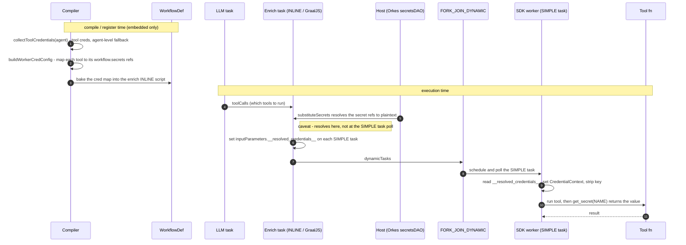
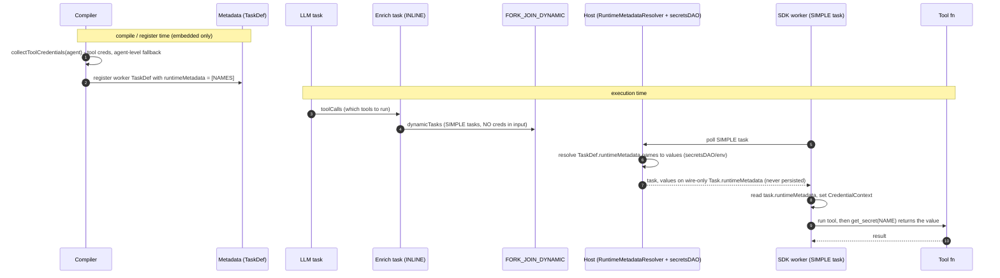

# Secret delivery toggle: native (standalone) vs host-delivered (embedded)

**Date:** 2026-07-09 · **Status:** In progress · **Branch:** `feature/embedded-secret-toggle`

## Summary

AgentSpan keeps its full native credential mechanism and toggles it with one flag, `agentspan.embedded`:

| Deployment | `agentspan.embedded` | Secrets |
|---|---|---|
| **Standalone** agentspan server | `false` (default) | **Native**: encrypted store, execution-token minting, `/api/workers/secrets` pull, SDK fetchers. Unchanged from `main`. |
| **Embedded** in orkes-conductor / conductor-oss | `true` | **Native dormant** (beans gated off); the **host** resolves secrets. |

Nothing is deleted — the native code stays intact for standalone.

## How secrets are delivered when embedded (split by task type)

- **Worker tools (SIMPLE, polled by the SDK)** → the worker's `TaskDef.runtimeMetadata` declares the
  secret names; the host resolves them at poll and injects the values onto the **wire-only
  `Task.runtimeMetadata`**. This is the **target**. Until the client SDKs expose that field (see
  table), we ship an **interim**: the compiler stamps
  `inputParameters.__resolved_credentials__ = {NAME: "${workflow.secrets.NAME}"}` and the host
  resolves it — same delivery, but it rides in the task-input `Map` that today's clients already keep.
- **System tasks (LLM `apiKey`, HTTP/MCP/planner headers — in-process on the host)** → the compiler
  stamps `${workflow.secrets.NAME}` into task input; the host substitutes in memory before the call.
  Not polled by a worker, so there's no `Task.runtimeMetadata` to read. Identical for target and interim.

## Interim worker path (enrichment) — how it actually works

Worker tools aren't static: the LLM picks them, an **INLINE "enrich" task** (GraalJS) builds the
SIMPLE tasks at runtime, and a `FORK_JOIN_DYNAMIC` schedules them. The per-tool cred map is baked
into the enrich script at compile time.

### Interim sequence (`__resolved_credentials__`)

**Caveat:** because the reference is baked into the INLINE script, the host resolves
`${workflow.secrets.NAME}` **at the enrich step**, not at the SIMPLE task's poll. So plaintext lands
in the forked task's **persisted** input, and a secret with JS-special chars (`"`, `\`, newline) can
break the script. The target fixes both.

## Target vs interim — same runtime cost, better safety

`get_secret(NAME)` (and `getCredential` / `ToolContext.getCredential` / `Secrets.Get`) is an
**in-memory lookup**: the worker stashes the resolved `{NAME: value}` map in a per-invocation context
and the accessor reads it. When embedded, the value is delivered **inline with the task** (poll
response) in both paths — **no extra calls** (only the standalone native path calls
`/api/workers/secrets`). So the choice is about safety, not performance — the target wins on:

1. **Wire-only, never persisted** — `Task.runtimeMetadata` is on the poll response only; the interim
   bakes plaintext into the forked task's persisted input (visible in execution history).
2. **No JS-injection** — declared names on the TaskDef vs a `${...}` reference baked into GraalJS
   (special chars break it).
3. **Resolved at the SIMPLE task's own poll**, scoped to that task — not early, in a shared enrich task.
4. **First-class & declarative** — the conductor-native field vs a magic `__resolved_credentials__` key.

Cost: the target needs the client libraries to expose `Task.runtimeMetadata` first — which is why the
interim ships now.

## Required change in each Conductor client SDK (blocks the target)

`Task.runtimeMetadata` is a new top-level field; today's clients drop it on the wire (no field, no
catch-all deserializer). Add it to each client's `Task` model (JSON key `runtimeMetadata`,
string→string, output-empty omitted), release, and bump the SDK's client dependency.

| AgentSpan SDK | Client dependency | Client repo | Change to the `Task` model |
|---|---|---|---|
| Java | `org.conductoross:conductor-client:5.0.1` | `conductor-oss/java-sdk` | Add `Map<String,String> runtimeMetadata` + getter/setter to `com.netflix.conductor.common.metadata.tasks.Task` (Jackson auto-maps; `@JsonInclude(NON_EMPTY)`). |
| Python | `conductor-python>=1.3.11` | `conductor-oss/python-sdk` | In `.../models/task.py`: add `runtime_metadata` to `swagger_types`/`attribute_map` (`'runtimeMetadata'`) + property. |
| C# | `conductor-csharp:1.1.4` | `conductor-oss/csharp-sdk` | Add `Dictionary<string,string> RuntimeMetadata` with `[DataMember(Name="runtimeMetadata", EmitDefaultValue=false)]`. |
| TypeScript | `@io-orkes/conductor-javascript:^3.0.3` | Orkes TS SDK | Add `runtimeMetadata?: Record<string,string>` to the `Task` type (JS keeps unknown keys; this is a type-def change so the read-path compiles). |

(Go is out of scope — AgentSpan ships no Go SDK.)

## Implementation (done + tested; CI green)

- **Gating:** `@ConditionalOnProperty(agentspan.embedded=false, matchIfMissing=true)` on every native
  secret bean — `WorkerController`, `CredentialResolutionService`, `ExecutionTokenService`,
  `CredentialAwareMcpService`, `CredentialMaskingResponseAdvice`, `EncryptedDbCredentialStoreProvider`,
  `MasterKeyConfig`, `CredentialEnvSeeder`, `CredentialSchemaMigrator`, `CredentialDataSourceConfig`,
  `NoOpSecretOutputMasker`. Active consumers made tolerant: `AgentspanAIModelProvider` (`ObjectProvider`
  + guards); `AgentService` / `AgentEventListener` (`@Autowired(required=false)` + null guards, so token
  minting is skipped).
- **System tasks:** `AgentChatCompleteTaskMapper.injectCredentialReferences` + `LlmProviderEnv` stamp
  `apiKey=${workflow.secrets.<KEY>}`; `AgentspanAIModelProvider` reads it back. HTTP/MCP/planner headers
  already emit `${workflow.secrets.NAME}`.
- **Worker tools (interim):** `ToolCompiler.buildWorkerCredConfig` + `JavaScriptBuilder` enrich
  injection + `AgentCompiler.collectToolCredentials`.
- **SDK read-path (all 4):** prefer the host map, else native token-pull; feed the existing accessor;
  strip the key. Interim reads `inputData.__resolved_credentials__`; target reads `task.runtimeMetadata`.
- **Tests (all fail-first validated):** `NativeSecretGatingTest`, `ToolCompilerWorkerCredTest`
  (GraalJS-runs the enrich script), `ReadResolvedCredentialsTest` (Java), `test_resolved_credentials.py`
  (Python), TS `credentials.test.ts`.

## The target change — main files (once clients expose `runtimeMetadata`)

Net effect: **declare** secret names on the TaskDef instead of **stamping** a value-reference into
task input; the enrich script stops touching credentials entirely, which deletes the
JS-injection/persistence caveat above. System-task delivery (`${workflow.secrets.NAME}`) is untouched.

### Target sequence (`TaskDef.runtimeMetadata`)

Versus the interim: the enrich task never touches credentials, resolution happens at the SIMPLE
task's **own poll** (not the enrich step), and the value arrives on the **wire-only**
`Task.runtimeMetadata` — so nothing is baked into the script and no plaintext lands in persisted input.

**0. Client libraries (prereq)** — add `Task.runtimeMetadata` per the table, release, and bump the
client dep in `sdk/java/build.gradle`, `sdk/python/pyproject.toml`, `sdk/csharp/.../Conductor.AI.csproj`,
`sdk/typescript/package.json`.

**1. Server — declare, and stop stamping** (all embedded-gated on `EmbeddedMode.isEmbedded()`):

| File | Change |
|---|---|
| `service/AgentService.java` | **ADD.** In `registerTaskDef`, set `taskDef.setRuntimeMetadata(names)` for each worker tool, where `names = AgentCompiler.collectToolCredentials(config).get(tool)`. This is the whole target delivery on the server. |
| `compiler/ToolCompiler.java` | **REMOVE** `buildWorkerCredConfig()` + `setWorkerCreds` + the `workerCredJson` argument passed to `enrichToolsScript` / `enrichToolsScriptDynamic`. |
| `util/JavaScriptBuilder.java` | **REMOVE** the `workerCredJson` param and the `if (workerCredCfg[n]) t.inputParameters.__resolved_credentials__ = …` lines in both enrich scripts. |
| `compiler/AgentCompiler.java`, `MultiAgentCompiler.java` | **MOVE.** Drop the `tc.setWorkerCreds(...)` calls; `collectToolCredentials` now feeds `AgentService` instead of `ToolCompiler`. |
| `ai/AgentChatCompleteTaskMapper.java`, `LlmProviderEnv.java` | **UNCHANGED** — system-task `${workflow.secrets}` path stays. |

**2. SDK worker read-path — read the field instead of the input key** (native token-pull fallback
stays in all four):

| File | Change |
|---|---|
| `sdk/java/.../internal/WorkerManager.java` | `task.getRuntimeMetadata()` instead of `inputData.get("__resolved_credentials__")`. |
| `sdk/python/.../runtime/_dispatch.py` | `task.runtime_metadata` instead of `task.input_data.pop("__resolved_credentials__")`. |
| `sdk/csharp/.../WorkerManager.cs` | `task.RuntimeMetadata` instead of the `__resolved_credentials__` dict; drop the input-strip. |
| `sdk/typescript/src/worker.ts` | `task.runtimeMetadata` instead of `inputData["__resolved_credentials__"]`. The `credentials.ts` accessor (reads the resolved map from the context) is unchanged. |

**3. Cleanup** — once all SDKs are on the new clients, delete the interim `__resolved_credentials__`
stamping (server) and reads (SDKs), plus `ToolCompilerWorkerCredTest`'s enrich-script assertions.

The compiler/enrich change is a **deletion**; the real new code is one line in `AgentService`
(`setRuntimeMetadata`) plus a one-line read swap per SDK. Everything else (gating, system tasks,
accessors, native fallback) is already in place.

## Dependency

AgentSpan uses no PR #1255 API, so it builds/tests against the published `conductor 3.32.0-rc.3`.
`${workflow.secrets.NAME}` (and, in the target, `TaskDef.runtimeMetadata`) are resolved **at runtime
by the embedded host** (`substituteSecrets` / `RuntimeMetadataResolver` / `SecretsDAO`, PR #1255) — the
host must include PR #1255; agentspan does not build against it. (An earlier local
`…-runtimemeta-LOCAL` pin was reverted: its conductor-side `SecretResource` shadowed agentspan's
`SecretController` `GET /api/secrets` in standalone tests.)

## Status

| Item | State |
|---|---|
| Native mechanism gated on `agentspan.embedded` | ✅ done + tested |
| System-task `${workflow.secrets}` delivery | ✅ done |
| Worker tools — interim `__resolved_credentials__` (server + 4 SDKs) | ✅ done + tested (CI green) |
| Worker tools — target `TaskDef.runtimeMetadata` | ⏳ blocked on client-SDK field (table) |
