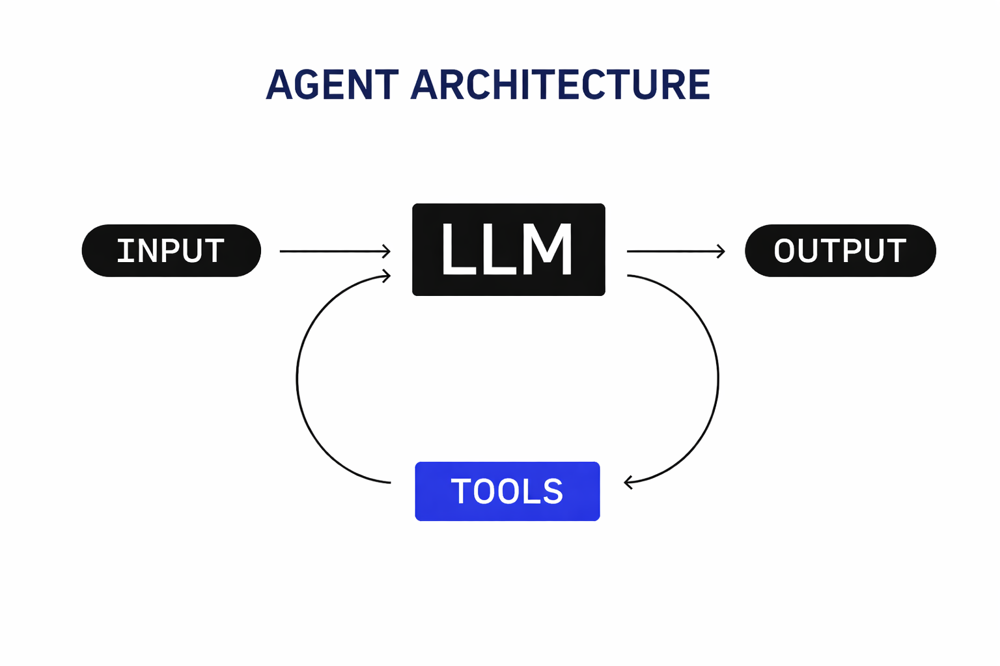

# Building a Coding Agent from Scratch: What's Really Under the Hood

I've heard people say that agents like Claude Code or Codex are "just wrappers around an LLM."

If you oversimplify things… yeah, that's not entirely wrong, kind of like saying software development is just input → processing → output, IYKWIM.



In practice, there's a lot more engineering behind it.

You need to:

* provide tools the agent can actually use  
* manage context — the right information, at the right time, across interactions  
* and orchestrate all of this in a reliable way

That's where frameworks can help — and there are quite a few out there. I'm part of the team building Agentspan, and through both developing it and using it, I've learned a lot. This post walks through an example I found particularly interesting—one that brings together several of the things I've been working on.

In this post, I'll walk through one of my contributions: [a durable coding assistant REPL](https://github.com/agentspan-ai/agentspan/pull/117) (inspired by tools like Claude Code), built with Agentspan and powered by Conductor OSS.

> **Note:** This isn't meant to be a production-ready coding agent. But it *is* a concrete, working example that shows what's really going on under the hood—and how you can build something similar yourself.

---

## What is an Agent, Really?

Strip away the hype, and an agent is remarkably simple: it's a loop. Observe something, decide what to do, optionally take an action, repeat. The LLM is just the decision-making component—the part that reads the current state and picks the next step.

That simplicity is deceptive.

The real engineering challenge isn't the LLM call. It's everything around it. How do you expose capabilities to the agent in a safe, predictable way? How do you pass the right context without overwhelming it? How do you manage state across hundreds of interactions? How do you know what the agent actually did when something goes wrong?

These aren't problems that stronger models solve. They're engineering problems.

---

## Why Does This Need a Framework?

If you're building a simple agent, you can write it as a while-loop in Python. Call the LLM, parse the response, execute a tool, loop. It works wonderfully — until you need it to be more robust.

In production, your agent process will crash. A bug, an OOM error, a network hiccup—and everything in memory is gone. Conversation history, intermediate results, partial progress. The user sees a hung connection and a lost session. You lose visibility into what happened before the crash.

Want to know exactly what your agent did, when, and why? You're reading log files. You're hoping the right information was logged at the right level. A month later, a user reports a bug and you can't reproduce it because you don't have the full execution trace.

None of these are prompting problems. A model that's 10x smarter doesn't fix a crashed process or make state durable. These are application-level problems — tooling and orchestration around the LLM.

---

## The Architecture: Agents as Workflows

In Agentspan, an agent definition compiles to a Conductor workflow. Conductor is an open-source orchestration engine originally built for microservice coordination—and it turns out that the primitives it provides (durable state, task routing, observability, retry logic) map directly to what agents need.

Here's what an agent definition looks like:

```python
agent = Agent(
    name="coding_agent",
    model="gpt-4.1",
    tools=[read_file, write_file, run_shell, reply_to_user],
    instructions="You are a coding assistant. Use tools to help the user.",
    stateful=True,
)
```

At registration time, this compiles to a workflow definition on the server. Tools become distributed tasks. The LLM call itself becomes a system task. When you execute the agent with a prompt, the server orchestrates everything—making LLM calls, invoking tools, managing state, recording every step.

What does this buy you?

**Durability.** State lives on the server, not in your process. If the client disconnects or crashes, the agent's state is still there. You can reconnect and resume. If the server restarts, unfinished executions pick up where they left off.

**Observability.** Every tool call, every LLM decision, every branch taken is recorded. Want to debug why an agent did something unexpected? You don't grep through logs. You query the execution history. You see exactly what context the agent had, what the LLM returned, and what happened next.

**Scalability.** Tools execute on workers—separate processes that poll for tasks. You can scale tool execution independently of the orchestration layer. Need more capacity for shell commands? Add workers. The agent logic doesn't change.

This architecture isn't novel in distributed systems terms. It's how we've been building reliable, observable, scalable systems for years. The novelty is applying it to the agent loop.

---

## Making Agents Interactive: The Messaging Problem

Most agent examples are one-shot: send a prompt, get a result, done. But the interesting case is a long-lived interactive agent—one that loops indefinitely, like Claude Code. The user types, the agent works, responds, and waits for the next input. A continuous conversation.

This might be a bit more tricky than you'd imagine.

You need a way for the agent to *wait* for user input without consuming resources. You need messages to survive network interruptions—if the user sends something and the connection blips, that message can't be lost. You need the ability to send messages while the agent is busy, with those messages queuing up for later. And you need a way to redirect the agent mid-task without interrupting what it's currently doing.

The solution was building a [Workflow Message Queue (WMQ)](https://github.com/conductor-oss/conductor/pull/982)* into Conductor: a server-side durable queue, one per workflow execution, stored in the database. When the user sends a message, it lands in this queue. The agent checks it and blocks until something arrives. If the client crashes after sending, the message is safe. If the agent is busy, messages queue up. If the server restarts, the queue persists.

We also added "signals"—a mechanism to inject context into a running agent asynchronously. A signal doesn't go through the queue. It updates a workflow variable that the agent sees on its very next decision step. This is how you tell an agent "focus only on the auth module" while it's in the middle of scanning a codebase—without interrupting the current operation, without losing state.

This is distributed systems engineering, not AI work.

> *\*WMQ is still a work in progress. The default storage is in-memory. We're adding a SQLite-backed option for local dev environments soon; production deployments should use Redis.*

---

## What We Built to Prove It

To put this to the test, we built a proof-of-concept: a terminal-based coding assistant with a simple TUI. It's inspired by Claude Code, simplified and purpose-built to exercise the infrastructure.

The agent has access to file system tools (read, write, search), shell execution, and background process management. The UI has one pane showing the conversation and another where you can type while the agent is working. If your connection drops, you can reconnect to the same session and resume where you left off.

The simple REPL version is about 540 lines of Python; the TUI version is around 780. The framework handles durability, task routing, event streaming, and state synchronization.

---

## The Bottom Line

Agent development isn't "just prompting." It's the intersection of AI, distributed systems, and developer experience.

Frameworks like Agentspan exist to handle the infrastructure — durability, message queuing, session isolation, event streaming — so teams can focus on what their agents actually do.

The simple REPL version is about 540 lines of Python; the TUI version is around 780. The framework handles the rest. Check out [the PR](https://github.com/agentspan-ai/agentspan/pull/117). Honestly, it was fun to build. I hope you find it useful.

Cheers!

