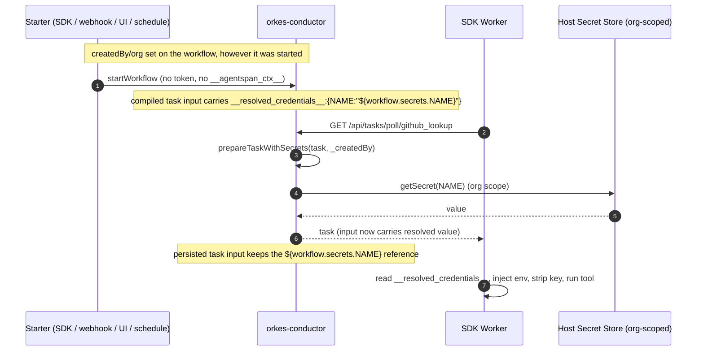

# Credential Delivery — Full orkes `${workflow.secrets.NAME}` Delegation

**Date:** 2026-06-25
**Status:** Implemented
**Branch:** `feature/fix_webhook_execution_token`
**Supersedes:** the execution-token / `__agentspan_ctx__` / `/api/workers/secrets` pull model
AND the poll-time-injection (`WorkerSecretPollAdvice`) model that briefly preceded this.

---

## TL;DR

When **embedded** in a host (orkes-conductor), AgentSpan resolves **no** credentials
itself. Every credential need — LLM provider keys, MCP/HTTP headers, and SDK
worker-tool secrets — is expressed as a Conductor-native `${workflow.secrets.NAME}`
reference physically present in **task input**. The host resolves these just-in-time
(never persisting the plaintext) exactly as it does for any other workflow.

**Standalone** (OSS) is deliberately **non-secure**: there is no credential store, no
secrets API, no in-process resolution. Worker tools simply receive no secrets. Security
exists only when deployed inside a host that owns a secret store.

---

## 1. Problem & history

AgentSpan tools compile to Conductor tasks. Some run **in-process as system tasks**
(the `LLM_CHAT_COMPLETE` task, MCP `CALL_MCP_TOOL`, HTTP). Others run as **SIMPLE
tasks** executed by out-of-process SDK workers. All of them may need a secret
(`GITHUB_TOKEN`, an LLM key, …).

This branch went through several iterations before arriving at the current design:

| Iteration | Mechanism | Why abandoned |
|---|---|---|
| 1. Status listener | Mint an execution token in `onWorkflowStarted`, mutate workflow input | orkes does not persist a status-listener's mutations → token lost |
| 2. System task | Compiler injects an `AGENTSPAN_MINT_TOKEN` first node | Visible distracting node; still a bespoke capability token |
| 3. Pull-based | Worker sends `workflowId`, server returns secrets from `/api/workers/secrets` | Still a special endpoint + an SDK fetcher in four languages |
| 4. Poll-time injection | `WorkerSecretPollAdvice` substitutes per-user values into the polled task input | Works only when agentspan owns the poll path. In a real orkes-embedded deployment the **host** serves the poll, so the advice never runs — the SDK worker path got no secrets. |
| **5. orkes `${workflow.secrets}` (this doc)** | Stamp secret references into task input; the host resolves them natively | — |

The guiding principle that ended the iteration:

> When embedded, the host is the authority for secrets. AgentSpan should resolve
> nothing in-process — it should only emit `${workflow.secrets.NAME}` references and
> let the host substitute them just-in-time, the same way it does for every other task.

---

## 2. How the host resolves references (verified in orkes-conductor)

- **In-process system tasks** (`LLM_CHAT_COMPLETE`, MCP, HTTP): `OrkesWorkflowExecutor`
  calls `substituteSecret(inputData)` immediately before `start()`/`execute()` and then
  `setInputData(previousInput)` to **revert before persisting**. Plaintext lives in
  memory for one execution only.
- **External workers** (SIMPLE worker tools): `TaskResource.poll` →
  `prepareTaskWithSecrets(task, user)` resolves references in the **poll response** using
  the task's `_createdBy` (auto-stamped from `workflow.getCreatedBy()` at schedule time
  when `securityEnabled=true`). The persisted task input keeps the reference.
- `substituteSecret` walks nested Maps **and** Lists recursively, so a nested
  `__resolved_credentials__: { NAME: "${workflow.secrets.NAME}" }` in task input is
  resolved.
- **Scope is per-ORG, not per-user** (`PostgresSecretsDAO`: `WHERE org_id = ? AND name = ?`
  — no per-user column). The org is derived from the workflow id, itself stamped from the
  creator's org at start. Per-user *values* are not achievable through orkes secrets; this
  was accepted as a deliberate trade-off (see §6).

---

## 3. Architecture — three reference-stamping sites, all compile/schedule time

### 3.1 LLM provider keys — `AgentChatCompleteTaskMapper`

When embedded, `getMappedTask` stamps `apiKey = "${workflow.secrets.<PROVIDER_KEY>}"`
into the LLM task input (provider → env-var via `LlmProviderEnv`, e.g.
`openai → OPENAI_API_KEY`). The host substitutes it before the in-process LLM system
task runs. `AgentspanAIModelProvider.getModel()` reads the resolved `apiKey` from the
task input and builds a fresh model with it.

- Only the **required** API key is stamped. Base URL and Gemini project id are **not**
  auto-stamped: orkes hard-fails on a *missing* secret reference, and those are optional,
  so an unconditional reference would break every call when the secret is absent. An agent
  that wants a secret-backed base URL can set `base_url` to a `${workflow.secrets.X}`
  literal in its own config, which flows through and is resolved by the host.
- **Standalone** injects nothing → the provider falls back to the server-wide
  `System.getenv` key, then to the model configured at startup.

### 3.2 MCP / HTTP headers — `ToolCompiler.rewriteCredentialPlaceholders`

Already in place: when embedded, the SDK's `${NAME}` header placeholders are rewritten to
`${workflow.secrets.NAME}`. MCP and HTTP tool calls run as in-process system tasks, so the
host substitutes the headers before the call. `CredentialAwareMcpService` (which resolved
the standalone `#{NAME}` form in-process) is **deleted**; the upstream `MCPService`
`@Component` takes over and receives already-resolved headers.

### 3.3 SDK worker-tool secrets — enrich script + static sites

SDK worker tools are dispatched dynamically by a baked-in GraalJS "enrich" script. When
embedded, each SIMPLE worker-tool task gets
`inputParameters.__resolved_credentials__ = { NAME: "${workflow.secrets.NAME}" }`:

- **Dynamic path** — `ToolCompiler.buildEnrichTask` / `buildEnrichTaskDynamic` build a
  `workerCredCfg` map (gated on `EmbeddedMode.isEmbedded()`), serialize it into the enrich
  script, and the SIMPLE branch injects it:
  `if (workerCredCfg[n]) t.inputParameters.__resolved_credentials__ = workerCredCfg[n];`
- **Static paths** — `AgentCompiler.compileFrameworkPassthrough` and `compilePrefillTasks`
  stamp the same map directly onto their single SIMPLE tasks.
- Per-tool names come from `AgentCompiler.collectToolCredentials` (a tool's own declared
  credentials, falling back to agent-level credentials), plumbed into `ToolCompiler` via
  `setWorkerCreds` so the agent-level fallback is preserved. HTTP/MCP tools are excluded
  (their secrets travel as headers).

The host resolves `__resolved_credentials__` at poll time via `prepareTaskWithSecrets`.

### 3.4 Worker — read like any field (SDK contract, unchanged)

The SDK runtime reads `__resolved_credentials__` from the task input, injects the values
(env / credential context), and **strips the key** before invoking the tool. Identical
contract across Python / TypeScript / Java / C#.

---

## 4. Components

### Server (`conductor-agentspan`)
- **`AgentChatCompleteTaskMapper`** — stamps the LLM `apiKey` secret reference when embedded.
- **`AgentspanAIModelProvider`** — reads the resolved `apiKey`/`baseUrl`/`geminiProjectId`
  from task input; no longer depends on `CredentialResolutionService` or `ExecutionDAOFacade`;
  keeps the standalone `System.getenv` fallback.
- **`LlmProviderEnv`** *(new)* — shared provider→env-var map.
- **`ToolCompiler`** — `rewriteCredentialPlaceholders` (MCP/HTTP) + `workerCredCfg` worker-tool
  stamping; `setWorkerCreds`.
- **`AgentCompiler`** — `collectToolCredentials` (now package-visible) plumbed into each
  `ToolCompiler`; static stamping for passthrough/prefill.
- **`CredentialMaskingResponseAdvice` / `SecretOutputMasker` (SPI) / `NoOpSecretOutputMasker`**
  — **kept**. The host supplies a real masker to redact host-resolved secrets from
  AgentSpan's execution-read APIs; standalone ships the no-op.

### SDKs (Python / TypeScript / Java / C#)
- The worker reads `__resolved_credentials__` from task input, injects to env / credential
  context, and strips the key. (Contract unchanged from iteration 4.)

### Deleted
`CredentialResolutionService`, `CredentialStoreProvider` SPI, `model/credentials/*`,
`CredentialAwareMcpService`, `CredentialAwareHttpTask(+Config)`, `WorkerSecretPollAdvice`,
`SecretController` (`/api/secrets`), `KnownProviderEnvVars`, and the server-module standalone
store (`EncryptedDbCredentialStoreProvider`, `MasterKeyConfig`, `CredentialEnvSeeder`,
`CredentialSchemaMigrator`, `CredentialDataSourceConfig`, `schema-credentials*.sql`). The
`agentspan_tool_credentials` / `agentspan_workflow_credentials` def metadata is also removed.

---

## 5. Sequence — embedded worker-tool secret



---

## 6. Security model & trade-offs

- **Plaintext never persists.** The host resolves references in the transient poll
  response (workers) or in memory before reverting (system tasks). Persisted task input
  always carries the reference, not the value.
- **Org-scoped, not per-user.** Two users in the same org share a secret value. This is
  inherent to orkes' secret store and was accepted as the cost of full delegation.
- **Fail-loud on missing API key.** The LLM `apiKey` reference is stamped unconditionally
  in embedded; if the secret is absent the task fails with a clear host error rather than
  silently degrading.
- **Standalone is non-secure by design.** No store, no resolution, no secrets API. Worker
  tools get no secrets; MCP/HTTP `#{NAME}`/literal placeholders are left unresolved.
- **Assumption:** the embedded host runs `securityEnabled=true` (required for `_createdBy`
  stamping → worker-tool poll-path resolution).

---

## 7. Testing

- `ToolCompilerWorkerCredTest` — per-tool secret refs (embedded on/off), HTTP/MCP excluded,
  per-tool not union, agent-level fallback, dynamic variant, and a **GraalJS-executed**
  behavioral test asserting the built SIMPLE task actually carries `__resolved_credentials__`.
- `AgentChatCompleteTaskMapperTest` — embedded stamps `apiKey = ${workflow.secrets.<KEY>}`
  per provider; standalone stamps nothing.
- `AgentspanAIModelProviderTest` — builds a model from the host-resolved `apiKey` in task
  input; ignores an unresolved `${...}` placeholder; `isProviderConfigured` reflects only
  startup config.
- `AgentCompilerTest.testStampsWorkerCredentialsWhenEmbedded` — end-to-end compile carries
  the reference when embedded, absent when standalone.
- Per project rule, each new behavior was validated by making it fail first (injection
  disabled) before confirming it passes. Full server suite green.
- Obsolete store/poll-advice/secret-controller tests deleted; the masking-advice test
  (`CredentialMaskingWorkflowOptInTest`) is retained.

---

## 8. Why this is the right shape

- **The host is the authority.** Embedded AgentSpan resolves nothing — it emits
  Conductor-native references and the host substitutes them just-in-time, the same way it
  does for every other task. No agentspan-specific endpoint, token, or in-process store.
- **Every start path works** (SDK, webhook, UI, schedule) because identity is the
  workflow's own `createdBy`/org, not a token someone had to mint and thread in.
- **Standalone stays simple** — deliberately non-secure, with no store to operate or secure.
```
