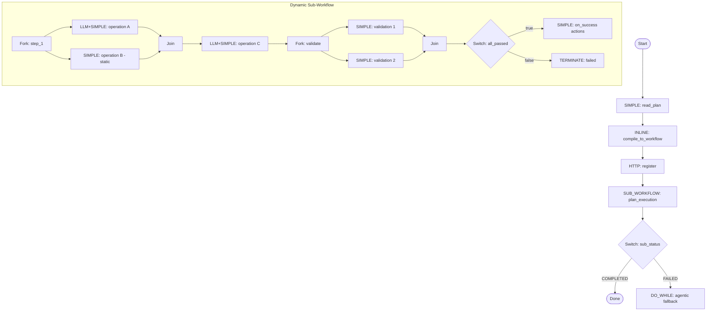

# Plan-Execute Harness — Dynamic Sub-Workflow Design

## Context

Agentic loops waste LLM turns on mechanical operations. When a planner has already decided *what* to do, the executor shouldn't need an LLM to decide *that* it should do it. Yet today, every tool call requires an LLM turn: "I'll call tool X" → tool_call(X) → "Now I'll call tool Y" → tool_call(Y). Each turn costs $0.10-0.50 and takes 5-30 seconds.

**The pattern**: A planner agent produces a structured plan (DAG of operations). Instead of feeding that plan to another agentic LLM that re-interprets it step-by-step, we compile the plan into a **Conductor workflow** and execute it deterministically. LLM is only invoked where it adds value: generating arguments for tool calls that require judgment (e.g., writing code, composing text). Everything else — orchestration, validation, branching — is pure Conductor.

### Decision: Dynamic Sub-Workflow

Plans can describe complex execution graphs (sequential dependencies, parallel groups, conditionals). A flat FORK_JOIN is too rigid. Instead, compile the structured plan into a **dynamic Conductor sub-workflow** at runtime — registered and executed as SUB_WORKFLOW. This supports arbitrary DAG complexity and is domain-agnostic.

---

## 1. Generic Architecture

```
┌──────────────────────────────────────────────────────────────┐
│ harness (Strategy.PLAN_EXECUTE)                              │
│                                                              │
│  ┌──────────────┐     ┌───────────────────────────────────┐  │
│  │ planner      │     │ plan_executor (deterministic)     │  │
│  │ (agentic LLM)│     │                                   │  │
│  │              │     │  1. Read plan JSON                 │  │
│  │  Explores,   │     │  2. Compile → Conductor workflow   │  │
│  │  reasons,    │────▶│  3. Register workflow              │  │
│  │  writes plan │     │  4. Execute as SUB_WORKFLOW        │  │
│  │  w/ JSON     │     │  5. Run validations                │  │
│  │  fence       │     │  6. SWITCH: pass → on_success      │  │
│  └──────────────┘     │           fail → agentic fallback  │  │
│                       └───────────────────────────────────┘  │
└──────────────────────────────────────────────────────────────┘
```

**Happy path**: N parallel LLM calls (1 per operation that needs generation) + 0 sequential routing calls. Only the failure path invokes the full agentic loop, bounded by `fallback_max_turns`.

---

## 2. Generic Plan Schema

The planner outputs Markdown (for LLM readability in error recovery) with an embedded JSON fence (for Conductor to execute).

### Schema

```typescript
interface Plan {
  steps: Step[];
  validation?: Validation[];     // checks to run after all steps
  on_success?: ToolCall[];       // actions on validation pass (e.g., git commit)
  on_failure?: ToolCall[];       // actions before fallback (e.g., collect errors)
}

interface Step {
  id: string;                    // unique step identifier
  depends_on?: string[];         // step IDs this depends on (DAG edges)
  parallel: boolean;             // true = operations in this step run in parallel
  operations: Operation[];
}

interface Operation {
  tool: string;                  // tool name (edit_file, write_file, http_call, send_email, etc.)

  // EITHER static args (no LLM needed — execute tool directly):
  args?: Record<string, any>;

  // OR generated args (LLM produces tool arguments):
  generate?: {
    instructions: string;        // what the LLM should produce
    context?: string;            // additional context (current code, reference data, etc.)
    output_schema: string;       // JSON-encoded instance-shape example, e.g.
                               // '{"path":"...","content":"..."}'. Top-level
                               // keys become the tool's input arg names.
                               // Real JSON Schema ({"type":"object","properties":...})
                               // is rejected at compile time.
    model?: string;              // override model for this generation (default: harness model)
  };
}

interface Validation {
  tool: string;                  // tool to run (run_unit_tests, http_health_check, etc.)
  args?: Record<string, any>;    // tool arguments
  success_condition?: string;    // Restricted JS expression applied to tool output; truthy = pass.
                                 // The string is whitelisted against host access, function
                                 // declarations, loops, assignments, and control-flow keywords;
                                 // length-capped at 256 chars. Examples: "$.exit_code === 0",
                                 // "$.passed === true", "$.indexOf('passed') >= 0".
}

interface ToolCall {
  tool: string;
  args?: Record<string, any>;
}
```

### The key abstraction

An **operation** is a tool call whose arguments are either:
- **Static** (`args`): Known at plan time. Execute the tool directly as a SIMPLE task. No LLM needed.
- **Generated** (`generate`): The tool *what* is known, but the arguments require LLM judgment. A parallel LLM_CHAT_COMPLETE call produces the arguments, then the tool executes.

This separates *orchestration* (which tool, what order, what depends on what) from *generation* (what arguments to pass). Orchestration is deterministic. Generation is per-operation parallel LLM.

### Design decisions

- **`depends_on`** creates a DAG between steps. Steps without dependencies can run in parallel with each other.
- **`parallel: true`** means operations within a step run in parallel (FORK_JOIN). `false` means sequential (when operation B depends on A's output within the same step).
- **`validation`** is a list of tool calls with optional `success_condition`. All must pass for the plan to succeed.
- **`on_success` / `on_failure`** are post-hooks — tool calls that run after validation passes or fails (before agentic fallback).
- **Static operations don't invoke LLM** — they compile to SIMPLE tasks executed directly.
- **Generated operations each get 1 focused LLM call** — small context, structured JSON output, running in parallel.

---

## 3. Plan Compilation to Conductor Workflow

At runtime, after the planner writes the plan, an **INLINE (GraalJS) task** parses the JSON and generates a complete Conductor WorkflowDef. This workflow is registered via HTTP and executed as SUB_WORKFLOW.

### Compilation algorithm

```
Input: Plan JSON (steps, validation, on_success, on_failure)
Output: Conductor WorkflowDef JSON

1. Topological sort steps by depends_on

2. For each step (in topo order):
   a. For each operation in step:
      - If operation has `args` (static):
          → generate SIMPLE task: tool(args)
      - If operation has `generate` (needs LLM):
          → generate LLM_CHAT_COMPLETE task:
              system: "Output ONLY valid JSON matching: {output_schema}"
              user: "{instructions}\n\nContext:\n{context}"
          → INLINE task: parse LLM JSON output → extract tool args
          → SIMPLE task: tool(extracted_args)
   b. If step.parallel: wrap operation tasks in FORK_JOIN + JOIN
      If !step.parallel: sequence operation tasks

3. After all steps, append validation:
   - If multiple validations and no deps between them: FORK_JOIN
   - For each validation: SIMPLE task → INLINE(check success_condition)
   - Aggregate results: INLINE(all_passed?)

4. SWITCH on validation:
   - passed → execute on_success ToolCalls as SIMPLE tasks
   - failed → execute on_failure ToolCalls, then TERMINATE(FAILED) with error output
```

### Static wrapper workflow (compiled by AgentCompiler)

The harness itself is a static Conductor workflow that wraps the dynamic execution:

```
1. ctx_resolve + ctx_init                     ← standard context setup

2. SUB_WORKFLOW(planner)                      ← first sub-agent, agentic
   → planner runs normally, writes plan

3. SIMPLE(read_plan)                          ← read plan from contextbook/output

4. INLINE(extract_json_fence)                 ← GraalJS: extract ```json block
   → outputs: {plan_json: {...}, markdown_plan: "..."}

5. INLINE(compile_plan_to_workflow)           ← GraalJS: plan → WorkflowDef
   → outputs: {workflow_def: {...}, workflow_name: "..."}

6. HTTP(register_workflow)                    ← PUT to Conductor /api/metadata/workflow

7. SUB_WORKFLOW(plan_execution)               ← execute the dynamic workflow

8. SWITCH(plan_execution.status) {
     COMPLETED → done (on_success already ran inside sub-workflow)
     FAILED →
       SET_VARIABLE(errors from sub-workflow output)
       SUB_WORKFLOW(fallback_agent)           ← second sub-agent, agentic
         prompt = "Plan:\n{markdown}\n\nErrors:\n{errors}\n\nFix the issues."
         max_turns = fallback_max_turns
   }
```

### Generated workflow structure (example)



---

## 4. SDK Surface

### New strategy: `Strategy.PLAN_EXECUTE`

```python
harness = Agent(
    name="my_harness",
    model=SONNET,
    agents=[planner_agent, fallback_agent],
    strategy=Strategy.PLAN_EXECUTE,
    fallback_max_turns=5,        # LLM turns budget for error recovery
)
```

When `strategy=PLAN_EXECUTE`:
1. First sub-agent (planner) runs as normal agentic LLM
2. Planner's output is parsed for a JSON fence (```` ```json ```` block)
3. JSON plan is compiled into a dynamic Conductor sub-workflow
4. Sub-workflow is registered and executed
5. If sub-workflow succeeds → done
6. If sub-workflow fails → second sub-agent runs as agentic fallback with plan + errors in context

### Agent fields

```python
class Agent:
    # ... existing fields ...
    plan_source: dict = None         # Optional deterministic plan source.
                                     # {"tool": "tool_name", "args": {...}} — the named
                                     # tool is called after the planner; its output is
                                     # used as the plan if the planner's text fails fence
                                     # extraction. Validated at compile time: tool must
                                     # be registered on this harness or a sub-agent.
    fallback_max_turns: int = 5      # LLM budget for error recovery
```

---

## 5. Agentic Fallback (Error Recovery)

When the dynamic sub-workflow fails (validation didn't pass, tool call errored, etc.), the parent workflow invokes the second sub-agent as a bounded agentic loop.

```
DO_WHILE (max iterations = fallback_max_turns):
  LLM_CHAT_COMPLETE(
    system: fallback_agent.instructions
    messages: [
      {role: user, message: "Plan:\n{markdown_plan}\n\nErrors:\n{error_output}\n\nFix the issues."}
    ]
    tools: fallback_agent.tools
  )
  → standard tool_router (same as compileWithTools)
  → loop continues until: success condition met OR max iterations
```

**Why Markdown plan, not JSON?** The JSON is for Conductor. The Markdown is for the LLM — descriptions, reasoning, context. The fallback LLM needs to understand *intent*, not parse structure.

**Key principle**: Every failure mode degrades gracefully to existing agentic behavior. PLAN_EXECUTE is a fast-path optimization, not a replacement.

---

## 6. Coding Harness (Primary Instantiation)

The coding agent is the first and primary use case. Here's how the generic pattern maps to it.

### Planner output format

````markdown
## Change Map

### File: src/auth.py
Action: MODIFY
Instructions:
- Add `max_attempts` param to `login()` with default 5
- Call `check_rate_limit(user)` before return
Current code reference:
```python
def login(user, pwd):
    token = authenticate(user, pwd)
    return token
```

```json
{
  "steps": [
    {
      "id": "impl",
      "parallel": true,
      "operations": [
        {
          "tool": "edit_file",
          "generate": {
            "instructions": "Add max_attempts=5 param to login(). Call check_rate_limit(user) before return token.",
            "context": "def login(user, pwd):\n    token = authenticate(user, pwd)\n    return token",
            "output_schema": "{\"edits\": [{\"old_string\": \"...\", \"new_string\": \"...\"}]}"
          }
        },
        {
          "tool": "write_file",
          "generate": {
            "instructions": "Create rate_limit module with check_rate_limit(user) function...",
            "output_schema": "{\"path\": \"...\", \"content\": \"...\"}"
          }
        }
      ]
    },
    {
      "id": "tests",
      "depends_on": ["impl"],
      "parallel": true,
      "operations": [
        {
          "tool": "write_file",
          "generate": {
            "instructions": "Test login rate limiting: test_login_success, test_login_rate_limited...",
            "output_schema": "{\"path\": \"...\", \"content\": \"...\"}"
          }
        }
      ]
    }
  ],
  "validation": [
    {"tool": "lint_and_format"},
    {"tool": "build_check"},
    {"tool": "run_unit_tests", "success_condition": ".exit_code == 0"}
  ],
  "on_success": [
    {"tool": "run_command", "args": {"command": "git add -A -- ':!.contextbook' && git commit -m 'feat: add rate limiting to login'"}},
    {"tool": "write_implementation_report", "args": {"content": "..."}}
  ]
}
```
````

### Coding harness agent definition

```python
coder_planner = Agent(
    name="coder_planner",
    model=OPUS,
    stateful=True,
    max_turns=100,
    tools=[read_file, read_symbol, grep_search, glob_find, list_directory,
           file_outline, search_symbols, find_references, write_coder_plan],
    instructions=CODER_PLANNER_INSTRUCTIONS,  # updated to include JSON fence
)

coder_fallback = Agent(
    name="coder_fallback",
    model=SONNET,
    stateful=True,
    tools=[read_file, write_file, edit_file, edit_files, run_command,
           lint_and_format, build_check, run_unit_tests,
           write_implementation_report],
    instructions="You are fixing validation errors. The plan was already applied but validation failed...",
)

coder = Agent(
    name="coder",
    agents=[coder_planner, coder_fallback],
    strategy=Strategy.PLAN_EXECUTE,
    fallback_max_turns=5,
)
```

### Per-file LLM prompt templates

For `edit_file` (MODIFY):
```
System: You generate code edits as JSON. Output ONLY valid JSON, no markdown.
Format: {"edits": [{"old_string": "exact text to find", "new_string": "replacement text"}]}
Rules: old_string must match EXACTLY (whitespace-sensitive). Minimal, focused changes.

User:
File: {path}
Current code:
{context}

Instructions:
{instructions}
```

For `write_file` (CREATE):
```
System: You generate file content as JSON. Output ONLY valid JSON, no markdown.
Format: {"path": "relative/path", "content": "full file content"}

User:
Instructions:
{instructions}
```

Static operations (DELETE, git commands) need no LLM — they're direct SIMPLE tasks.

### Performance (5 files modified)

| Metric | Current (agentic) | PLAN_EXECUTE (happy path) | PLAN_EXECUTE (1 fallback) |
|--------|-------------------|--------------------------|--------------------------|
| LLM calls | ~15 sequential | 5 parallel (code gen) | 5 parallel + ~3 sequential |
| Wall clock | 15 × 10s = **2.5 min** | max(10s) + validation = **30s** | 30s + 30s fix = **60s** |
| Cost | 15 × full context = **$2.25** | 5 × small context = **$0.25** | $0.25 + $0.50 fix = **$0.75** |
| Savings | baseline | **~89% cost, ~80% time** | **~67% cost, ~60% time** |

---

## 7. Other Harness Examples

The generic plan schema supports any domain where work can be decomposed into tool calls.

### Content generation harness

Planner breaks an article into sections; each section is generated in parallel.

```json
{
  "steps": [
    {
      "id": "research",
      "parallel": true,
      "operations": [
        {"tool": "web_search", "args": {"query": "rate limiting best practices 2025"}},
        {"tool": "web_search", "args": {"query": "token bucket vs sliding window"}}
      ]
    },
    {
      "id": "write_sections",
      "depends_on": ["research"],
      "parallel": true,
      "operations": [
        {"tool": "write_file", "generate": {"instructions": "Write intro section (300 words)...", "output_schema": "{\"path\":\"...\",\"content\":\"...\"}"}},
        {"tool": "write_file", "generate": {"instructions": "Write implementation section...", "output_schema": "{\"path\":\"...\",\"content\":\"...\"}"}},
        {"tool": "write_file", "generate": {"instructions": "Write conclusion section...", "output_schema": "{\"path\":\"...\",\"content\":\"...\"}"}}
      ]
    }
  ],
  "validation": [
    {"tool": "run_command", "args": {"command": "wc -w draft/*.md"}, "success_condition": ".output | tonumber > 1000"}
  ],
  "on_success": [
    {"tool": "run_command", "args": {"command": "cat draft/intro.md draft/impl.md draft/conclusion.md > article.md"}}
  ]
}
```

### Data pipeline harness

Planner decides which transforms to apply; some are static SQL, some need LLM to generate queries.

```json
{
  "steps": [
    {
      "id": "extract",
      "parallel": true,
      "operations": [
        {"tool": "http_call", "args": {"url": "https://api.example.com/users", "method": "GET"}},
        {"tool": "http_call", "args": {"url": "https://api.example.com/orders", "method": "GET"}}
      ]
    },
    {
      "id": "transform",
      "depends_on": ["extract"],
      "parallel": false,
      "operations": [
        {"tool": "sql_execute", "args": {"query": "INSERT INTO staging.users SELECT * FROM json_each(?)"}},
        {"tool": "sql_execute", "generate": {
          "instructions": "Generate SQL to join users with orders, compute lifetime value, handle nulls",
          "context": "Schema: users(id, name, email), orders(id, user_id, amount, created_at)",
          "output_schema": "{\"query\": \"...\"}"
        }}
      ]
    }
  ],
  "validation": [
    {"tool": "sql_execute", "args": {"query": "SELECT COUNT(*) as c FROM analytics.user_ltv"}, "success_condition": ".c > 0"}
  ]
}
```

### DevOps / deployment harness

Planner generates a deployment sequence; most ops are static, LLM generates config patches.

```json
{
  "steps": [
    {
      "id": "pre_deploy",
      "parallel": true,
      "operations": [
        {"tool": "run_command", "args": {"command": "docker build -t app:v2.1 ."}},
        {"tool": "run_command", "args": {"command": "docker push registry/app:v2.1"}}
      ]
    },
    {
      "id": "deploy_staging",
      "depends_on": ["pre_deploy"],
      "parallel": false,
      "operations": [
        {"tool": "edit_file", "generate": {
          "instructions": "Update k8s deployment image tag to v2.1, add new env var RATE_LIMIT_ENABLED=true",
          "context": "current k8s/deployment.yaml contents...",
          "output_schema": "{\"edits\": [{\"old_string\": \"...\", \"new_string\": \"...\"}]}"
        }},
        {"tool": "run_command", "args": {"command": "kubectl apply -f k8s/ --context=staging"}}
      ]
    },
    {
      "id": "smoke_test",
      "depends_on": ["deploy_staging"],
      "parallel": true,
      "operations": [
        {"tool": "http_call", "args": {"url": "https://staging.example.com/health", "method": "GET"}},
        {"tool": "http_call", "args": {"url": "https://staging.example.com/api/v1/status", "method": "GET"}}
      ]
    }
  ],
  "validation": [
    {"tool": "http_call", "args": {"url": "https://staging.example.com/health"}, "success_condition": ".status_code == 200"}
  ],
  "on_success": [
    {"tool": "run_command", "args": {"command": "kubectl apply -f k8s/ --context=production"}}
  ],
  "on_failure": [
    {"tool": "run_command", "args": {"command": "kubectl rollback deployment/app --context=staging"}}
  ]
}
```

---

## 8. Server Changes (AgentCompiler)

### New compilation path: `compilePlanExecute()`

In `MultiAgentCompiler.java`, add alongside `compileSequential()`, `compileSwarm()`, etc.

### Key implementation details

**GraalJS plan compiler** (~200-300 lines JS): The core logic that converts plan JSON → WorkflowDef JSON.
- Topological sort steps by `depends_on`
- For each operation: static → SIMPLE task; generated → LLM_CHAT_COMPLETE + INLINE(parse) + SIMPLE
- Wrap parallel operations in FORK_JOIN + JOIN
- Append validation tasks
- Add SWITCH for pass/fail routing with on_success/on_failure hooks
- Generate unique `taskReferenceName` for every task

**HTTP registration**: `PUT` to `${__conductor_url__}/api/metadata/workflow` with the generated WorkflowDef.

**SUB_WORKFLOW execution**: Reference by name from the compiled workflow. Pass through `working_dir`, `session_id`, `credentials`.

**Tool execution**: Static and generated operations both resolve to SIMPLE tasks calling existing Conductor workers registered by the SDK.

---

## 9. Derived Prefills (Planner Optimization)

The planner often spends turns exploring/reading before it can plan. If a previous agent's output references specific resources, we can pre-fetch them.

```python
planner = Agent(
    ...,
    derived_prefills={
        "source": "architecture_design",     # contextbook section to parse
        "pattern": r"[\w/]+\.\w+",           # regex for extractable references
        "tool": read_file,                    # tool to call per match
    },
)
```

The server compiles this as: `INLINE(extract_refs) → FORK_JOIN_DYNAMIC(prefetch) → inject into planner context`.

---

## 10. Risks and Mitigations

| Risk | Impact | Mitigation |
|------|--------|------------|
| GraalJS plan compiler is complex | Hard to debug | Unit tests; start simple, add complexity |
| LLM output is malformed JSON | Operation fails | JSON validation in INLINE; retry once with "fix your JSON" |
| Tool call fails (e.g., edit_file old_string not found) | Step fails | Fallback to agentic loop which can inspect and retry |
| No JSON fence in planner output | `has_json` predicate returns `no_plan` | Try `plan_source` tool; else fall through to fallback agent (or TERMINATE if no fallback configured) |
| Plan compilation returns `{error: "..."}` (cycle, duplicate id, unsafe `success_condition`, malformed `output_schema`, JSON-Schema-shaped `output_schema`) | `compile_status` emits `compile_failed`; `compile_gate` SWITCHes | Routes to fallback agent when `fallbackConfig != null`, else TERMINATEs with the structured error string in `terminationReason` |
| Plan compilation returns null `workflow_def` with no error (defensive — should never happen given the compiler contract) | `compile_status` emits `compile_failed` (folded with the above) | Same path as compile error |
| LLM JSON parse failure inside a generated op | per-op `parseGate` SWITCH | TERMINATE FAILED inside the dynamic sub-workflow → bubbles to parent → fallback or TERMINATE |
| Tool failure inside a static or generated op | non-optional task fails the SUB_WORKFLOW | Parent `exec_route` routes to fallback agent (or TERMINATE) |
| Validation aggregator returns `'failed'` or null/garbage | validation `SWITCH` defaultCase fires | Runs `on_failure` hooks then TERMINATE FAILED → bubbles → fallback |
| `plan_source.tool` not registered on the harness | `isToolRegisteredInHarness` check at compile | `IllegalArgumentException` at deploy — never executes |

**Key principle**: Every failure degrades gracefully to existing agentic behavior. PLAN_EXECUTE is a fast-path optimization, not a replacement.
