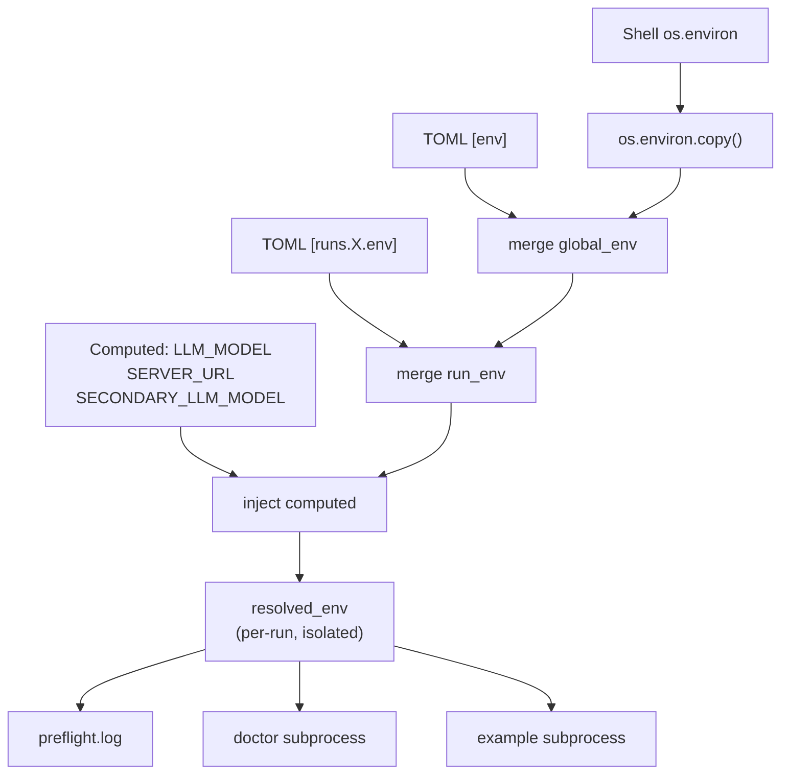
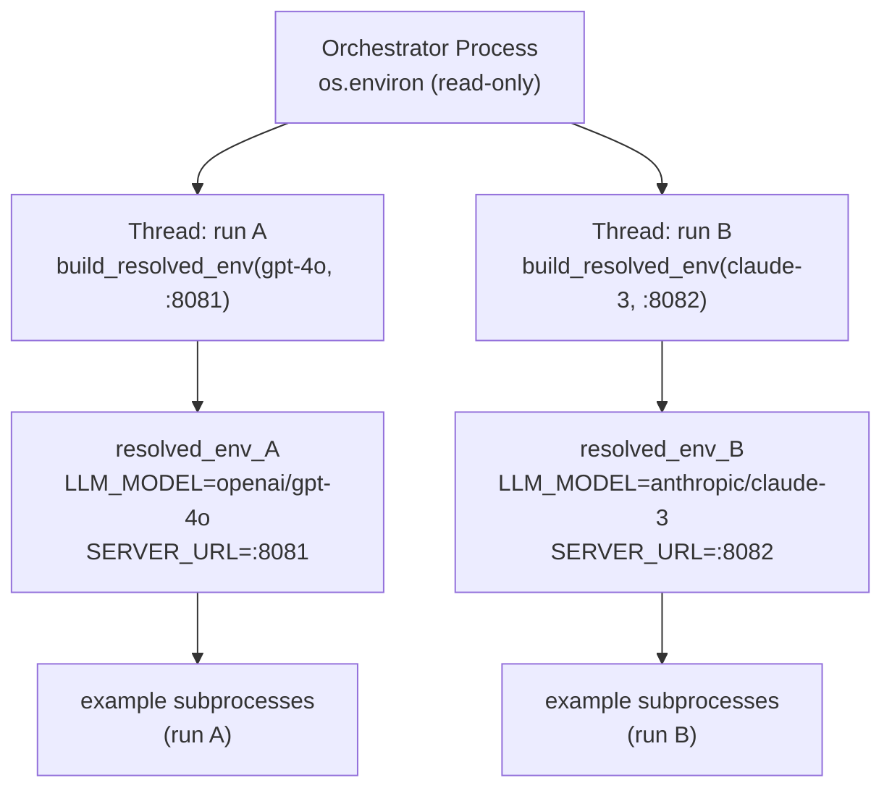

# Validation Design

## Architecture

TOML config defines named runs (one model each). Runs execute concurrently via the orchestrator. Multi-run LLM judge compares outputs against a baseline.

### Data Flow

```
runs.toml → load_toml_config() → resolve_runs() → run_all()
                                                       │
                                              ThreadPoolExecutor
                                               ┌───────┼───────┐
                                               ▼       ▼       ▼
                                          run_single  run_single  run_single
                                          (sub-dir)   (sub-dir)   (sub-dir)
                                               │       │       │
                                               └───────┼───────┘
                                                       ▼
                                               judge_across_runs()
                                                (judge/ sub-dir)
```

### Config Structure

```toml
[defaults]
timeout = 300
parallel = true
max_workers = 8

[judge]
baseline_run = "openai"
model = "gpt-4o-mini"

[runs.openai]
model = "openai/gpt-4o"
group = "SMOKE_TEST"

[runs.anthropic]
model = "anthropic/claude-sonnet-4-20250514"
group = "SMOKE_TEST"
```

`[defaults]` values merge into every `[runs.*]` (run-level overrides win).

## Execution

Each `run_single()`:
1. Discovers examples for the run's group
2. Starts ServerPool
3. Calls `run_examples()` — single model, concurrent examples via ThreadPoolExecutor
4. Writes `run_results.json`, `outputs/`, `meta.json`, `report.json` into run sub-dir

`run_example()` runs each example as a subprocess:
- Sets `AGENTSPAN_LLM_MODEL` and optionally `AGENTSPAN_SERVER_URL`
- Server: `python <script>` (hits Agentspan server)
- Parses stdout/stderr via `parse_output()` → `RunResult`

### Concurrency

- Runs execute concurrently (one ThreadPoolExecutor per orchestrator)
- Within each run, examples execute concurrently (`max_workers` from config)
- `run_results.json` is written after all examples complete; `report.json` updates are thread-safe (locks + atomic file replace)
- SIGINT triggers graceful abort — partial results are written before exit

### Scheduling

- Examples sorted slowest-first (from `report.json` history) for better load balancing
- `--resume` skips already-completed examples (checks output files)
- `--retry-failed` re-runs only examples with ERROR/TIMEOUT/FAILED status

## Example Discovery

```
Scan examples/ + examples/openai/ + examples/adk/
  → Filter by group (from groups.py)
  → Skip subdirs where dependency unavailable
```

### HITL stdin map

| Example | Stdin | Action |
|---------|-------|--------|
| `02_tools` | `y` | Approve send_email |
| `09_human_in_the_loop` | `y` | Approve transfer_funds |
| `09b_hitl_with_feedback` | `a` | Approve article publication |
| `09c_hitl_streaming` | `y` | Approve delete_service_data |

## Output Parsing

Extracts from stdout (produced by `AgentResult.print_result()`):

| Field | Regex / Method |
|-------|---------------|
| Execution ID | `Execution ID: (\S+)` |
| Tool calls | `Tool calls: (\d+)` |
| Tokens | `Tokens: (\d+) total \((\d+) prompt, (\d+) completion\)` |
| Agent output | Text between `╘═+╛` banner and next metadata line |
| Errors | `execution FAILED` in stdout/stderr, tracebacks, non-zero exit |

### Status determination

| Condition | Status |
|-----------|--------|
| `execution FAILED` in output | FAILED |
| exit_code == 0 and no errors | COMPLETED |
| Subprocess timed out | TIMEOUT |
| Non-zero exit code | FAILED |
| Other error detected | ERROR |

## Multi-Run LLM Judge

### Individual Scoring

One judge call per completed run per example — scores output against original prompt on a 1-5 scale:

| Score | Meaning |
|-------|---------|
| 1 | Completely wrong, irrelevant, or empty |
| 2 | Partially relevant but mostly incorrect |
| 3 | Relevant but missing key elements |
| 4 | Good, addresses the task well |
| 5 | Excellent, fully addresses the task |

### Baseline Comparison

After individual scoring, each non-baseline run is compared against the baseline run. The judge evaluates task-correctness, not surface similarity:

| Score | Meaning |
|-------|---------|
| 5 | Both correctly address the task, candidate equally valid |
| 4 | Candidate addresses task well, minor completeness differences |
| 3 | Candidate partially addresses task, misses key elements |
| 2 | Candidate attempts task but significant parts wrong |
| 1 | Candidate fails the task or irrelevant |

### Output Hash Caching

On each judge run, output text is hashed (SHA-256). If the output hash matches the previous run and a score exists, the cached score is reused.

### Prompt extraction

Parses each example's source to find the prompt:
```python
# Regex: (?:run|stream)\s*\(\s*\w+\s*,\s*"([^"]+)"
runtime.run(agent, "Say hello and tell me a fun fact")  →  extracted
```

## Environment Variable Injection

All env vars are built by `build_resolved_env()` in `execution/runner.py`. It never mutates `os.environ` — each call returns an independent dict.

### Merge Order



### Process Isolation



### AGENTSPAN_ Vars

| Variable | Source | Purpose |
|----------|--------|---------|
| `AGENTSPAN_LLM_MODEL` | computed (model_id) | Primary model for agent |
| `AGENTSPAN_SERVER_URL` | computed (server_url) | AgentSpan server endpoint |
| `AGENTSPAN_SECONDARY_LLM_MODEL` | computed (secondary_model) | Secondary model (guardrails etc.) |
| `AGENTSPAN_API_KEY` | shell / TOML env | Server auth |
| `AGENTSPAN_TIMEOUT` | shell / TOML env | Request timeout |
| `AGENTSPAN_MAX_RETRIES` | shell / TOML env | Retry budget |
| `AGENTSPAN_STREAM` | shell / TOML env | Streaming mode |
| `AGENTSPAN_DEBUG` | shell / TOML env | Debug logging |
| `AGENTSPAN_LOG_LEVEL` | shell / TOML env | Log verbosity |
| `AGENTSPAN_CONDUCTOR_URL` | shell / TOML env | Conductor backend |
| `AGENTSPAN_CONDUCTOR_AUTH_KEY` | shell / TOML env | Conductor auth |
| `AGENTSPAN_WORKER_DOMAIN` | shell / TOML env | Worker routing |
| `AGENTSPAN_POLLING_INTERVAL` | shell / TOML env | Worker poll interval |
| `AGENTSPAN_WORKER_THREAD_COUNT` | shell / TOML env | Worker concurrency |

## Output Files

```
validation/output/run_{timestamp}_{id}/
├── meta.json                    ← parent metadata
├── openai/               ← run sub-dir
│   ├── run_results.json         ← all example results + history
│   ├── meta.json
│   ├── report.json
│   └── outputs/
│       ├── 01_basic_agent.txt
│       └── ...
├── anthropic/
│   ├── run_results.json
│   └── outputs/...
└── judge/                       ← LLM judge results
    ├── judge_results.json       ← per-run scores, reasons, hashes (output + cache)
    ├── report.md
    ├── report.html              ← interactive dashboard
    └── meta.json
```
