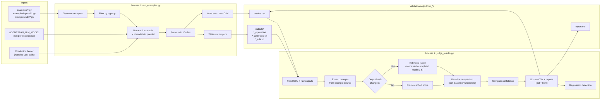
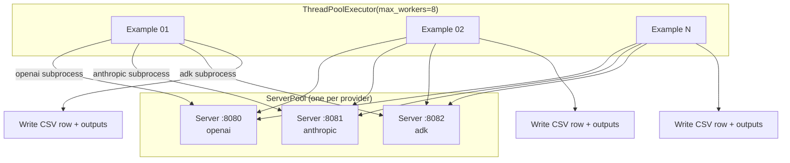
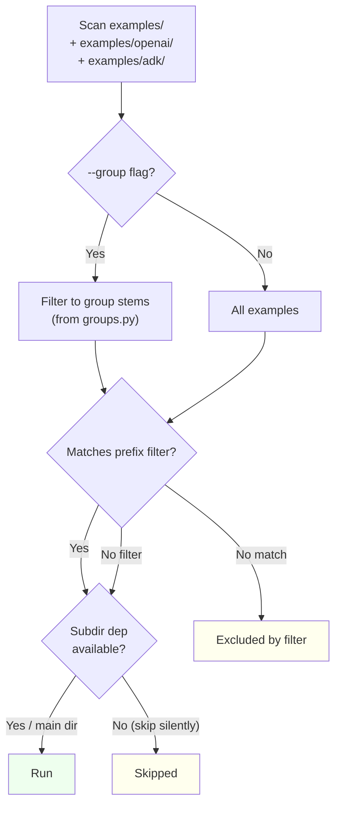
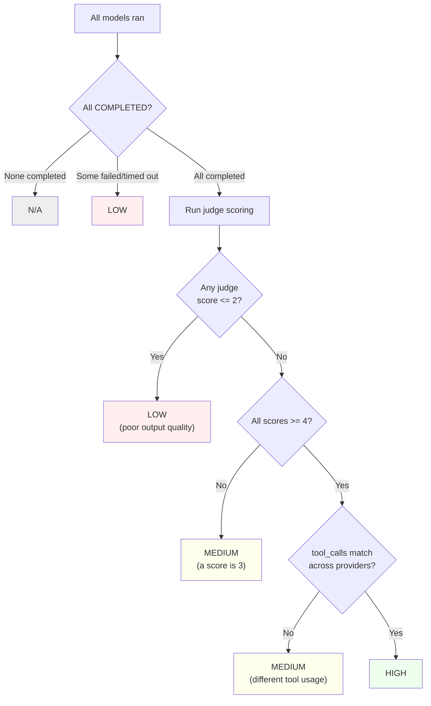

# Validation Design

## Architecture

Two decoupled scripts separate execution from evaluation.

### Data Flow



**Why two scripts?**
- Re-run judge without re-running expensive examples
- Try different judge models/prompts without re-executing
- Process 1 needs no API key — server handles LLM calls
- Debug judge independently

## Execution Modes

Two modes: **sequential** (default) and **parallel** (`-j`). Both use ThreadPoolExecutor to run models concurrently per example; parallel mode additionally runs multiple examples concurrently with dedicated servers.

### Sequential (default)

Single shared server. Examples run one at a time; models within each example run concurrently.

```
for each example:
    ┌──────────────────────────────────────────┐
    │ ThreadPoolExecutor(max_workers=len(MODELS))│
    │                                          │
    │  Thread 1: run with openai/gpt-4o        │
    │  Thread 2: run with anthropic/claude-...  │
    │  Thread 3: run with google_gemini/gemini  │
    │                                          │
    │  All hit the same server on :8080        │
    └────────────┬─────────────────────────────┘
                 │
                 ▼
    Parse stdout → extract workflow_id, tool_calls, tokens, output
    Detect errors → "workflow FAILED", tracebacks, non-zero exit
    Compute match (PASS/FAIL/PARTIAL) + preliminary confidence
    Write CSV row + raw output files
```

### Parallel (`-j`)

One dedicated Conductor server per provider. Examples run concurrently (up to `--max-workers`, default 8). Each provider's subprocess hits its own server, avoiding contention.



**ServerPool lifecycle:**
1. Assigns ports starting from `--base-port` (default 8080)
2. Reuses existing agentspan servers on assigned ports (health check)
3. Starts new servers in parallel via `agentspan server start -p PORT`
4. Waits up to 60s for each server health check
5. On shutdown: graceful `agentspan server stop`, then force-kill by port PID

**Concurrency controls:**
- `--max-workers N` — max concurrent examples (default 8)
- Each example still runs all models concurrently within its thread
- CSV writes and `.last_run.json` updates are thread-safe (locks + atomic file replace)
- SIGINT triggers graceful abort — partial results are written before exit

**Scheduling:**
- Examples sorted slowest-first (from `.last_run.json` history) for better load balancing
- `--resume` skips already-completed examples
- `--retry-failed` re-runs only examples with ERROR/TIMEOUT/FAILED status

The `AGENTSPAN_LLM_MODEL` env var is set per-subprocess, overriding whatever the example's `settings.py` would normally read from `os.environ`. In parallel mode, `AGENTSPAN_SERVER_URL` is also overridden per-subprocess to point at the provider's dedicated server.

## Example Discovery



### HITL stdin map

| Example | Stdin | Action |
|---------|-------|--------|
| `02_tools` | `y` | Approve send_email |
| `09_human_in_the_loop` | `y` | Approve transfer_funds |
| `09b_hitl_with_feedback` | `a` | Approve article publication |
| `09c_hitl_streaming` | `y` | Approve delete_service_data |

## Output Parsing

Extracts from stdout (produced by `AgentResult.print_result()`):

| Field | Regex / Method |
|-------|---------------|
| Workflow ID | `Workflow ID: (\S+)` |
| Tool calls | `Tool calls: (\d+)` |
| Tokens | `Tokens: (\d+) total \((\d+) prompt, (\d+) completion\)` |
| Agent output | Text between `╘═+╛` banner and next metadata line |
| Errors | `workflow FAILED` in stdout/stderr, tracebacks, non-zero exit |

### Status determination

| Condition | Status |
|-----------|--------|
| `workflow FAILED` in output | FAILED |
| exit_code == 0 and no errors | COMPLETED |
| Subprocess timed out | TIMEOUT |
| Non-zero exit code | FAILED |
| Other error detected | ERROR |

## LLM Judge

### Individual Scoring

One judge call per completed model — scores each output against the original prompt on a 1-5 scale:

| Score | Meaning |
|-------|---------|
| 1 | Completely wrong, irrelevant, or empty |
| 2 | Partially relevant but mostly incorrect |
| 3 | Relevant but missing key elements |
| 4 | Good, addresses the task well |
| 5 | Excellent, fully addresses the task |

Models that did not complete (FAILED, TIMEOUT, ERROR) are skipped by the judge.

### Baseline Comparison

After individual scoring, each non-baseline provider is compared against the baseline (default: `openai`). The judge evaluates task-correctness, not surface similarity:

| Score | Meaning |
|-------|---------|
| 5 | Both correctly address the task, candidate equally valid |
| 4 | Candidate addresses task well, minor completeness differences |
| 3 | Candidate partially addresses task, misses key elements baseline covered |
| 2 | Candidate attempts task but significant parts wrong |
| 1 | Candidate fails the task or irrelevant |

Different-but-valid outputs score high.

### Guardrails

| Setting | Default | Purpose |
|---------|---------|---------|
| `JUDGE_MAX_OUTPUT_CHARS` | 3000 | Truncate outputs before sending to judge |
| `MAX_JUDGE_CALLS` | 0 (unlimited) | Budget cap on total judge API calls |
| `JUDGE_RATE_LIMIT` | 0.5s | Delay between judge calls |

Response validation: scores clamped to 1-5, malformed JSON triggers warning.

Uses `response_format={"type": "json_object"}` for structured output.

### Output Hash Caching

On each judge run, output text is hashed (SHA-256). If the output hash matches the previous run and a score exists, the cached score is reused — saving API costs on re-runs.

### Regression Detection

Compares current judge scores to previous `last_run.json`. Score drops > 1 point are flagged as warnings.

### Prompt extraction

Parses each example's source to find the prompt:
```python
# Regex: (?:run|stream)\s*\(\s*\w+\s*,\s*"([^"]+)"
runtime.run(agent, "Say hello and tell me a fun fact")  →  extracted
```

### Cost Analysis

Token counts from execution CSV are multiplied by `MODEL_PRICING` (per 1K tokens). Estimated cost is stored in `meta.json` and shown in the HTML report.

## Confidence Levels

Confidence measures **execution reliability**, not output quality:

| Level | Criteria |
|-------|----------|
| **HIGH** | All COMPLETED, all judge scores >= 4 |
| **MEDIUM** | All COMPLETED, but a score is 3 or tool_calls differ |
| **LOW** | Some failed/timed out, any score <= 2, or any baseline_score <= 2 |
| **N/A** | All failed or skipped |

### Confidence Decision Matrix



## Output Files

All output goes to `validation/output/` (gitignored). Each run gets its own directory:

```
validation/output/
├── .last_run.json          ← judge scores, output hashes, history
├── latest → run_*/         ← symlink to newest run
├── run_2026-03-12_12-29-35_d766/
│   ├── results.csv
│   ├── report.md           ← added by judge_results.py
│   ├── report.html         ← interactive dashboard
│   ├── meta.json           ← timing, costs, regressions
│   └── outputs/
│       ├── 01_basic_agent_openai.txt
│       ├── 01_basic_agent_anthropic.txt
│       ├── 01_basic_agent_adk.txt
│       └── ...
└── ...
```

Directory format: `run_{YYYY-MM-DD}_{HH-MM-SS}_{run_id}/` where run_id = first 4 chars of UUID4.
