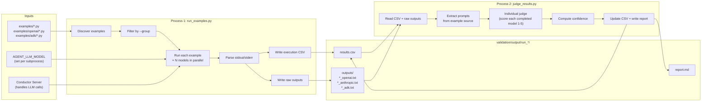
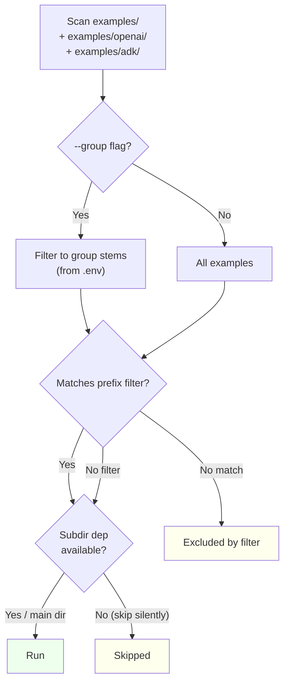
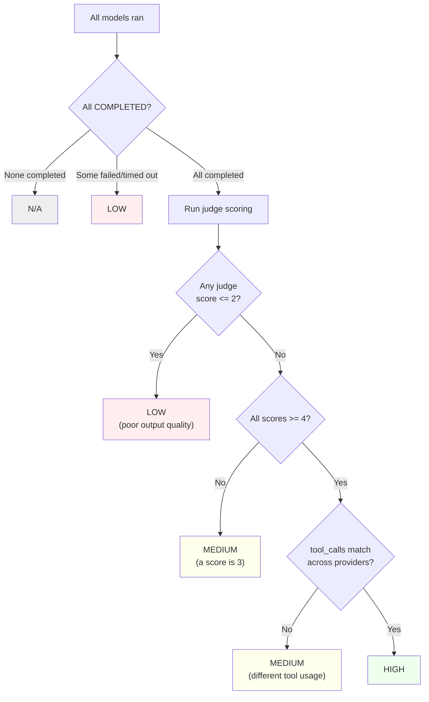

# Validation Design

## Architecture

Two decoupled scripts separate execution from evaluation.

### Data Flow



**Why two scripts?**
- Re-run judge without re-running expensive examples
- Try different judge models/prompts without re-executing
- Process 1 needs no API key — server handles LLM calls
- Debug judge independently

## Per-Example Execution

```
for each example:
    ┌──────────────────────────────────────────┐
    │ ThreadPoolExecutor(max_workers=len(MODELS))│
    │                                          │
    │  Thread 1: run with openai/gpt-4o        │
    │  Thread 2: run with anthropic/claude-...  │
    │  Thread 3: run with google_gemini/gemini  │
    │                                          │
    │  All run simultaneously                  │
    └────────────┬─────────────────────────────┘
                 │
                 ▼
    Parse stdout → extract workflow_id, tool_calls, tokens, output
    Detect errors → "workflow FAILED", tracebacks, non-zero exit
    Compute match (PASS/FAIL/PARTIAL) + preliminary confidence
    Write CSV row + raw output files
```

The `AGENT_LLM_MODEL` env var is set per-subprocess, overriding whatever the example's `settings.py` would normally read from `.env`.

## Example Discovery



### HITL stdin map

| Example | Stdin | Action |
|---------|-------|--------|
| `02_tools` | `y` | Approve send_email |
| `09_human_in_the_loop` | `y` | Approve transfer_funds |
| `09b_hitl_with_feedback` | `a` | Approve article publication |
| `09c_hitl_streaming` | `y` | Approve delete_service_data |

## Output Parsing

Extracts from stdout (produced by `AgentResult.print_result()`):

| Field | Regex / Method |
|-------|---------------|
| Workflow ID | `Workflow ID: (\S+)` |
| Tool calls | `Tool calls: (\d+)` |
| Tokens | `Tokens: (\d+) total \((\d+) prompt, (\d+) completion\)` |
| Agent output | Text between `╘═+╛` banner and next metadata line |
| Errors | `workflow FAILED` in stdout/stderr, tracebacks, non-zero exit |

### Status determination

| Condition | Status |
|-----------|--------|
| `workflow FAILED` in output | FAILED |
| exit_code == 0 and no errors | COMPLETED |
| Subprocess timed out | TIMEOUT |
| Non-zero exit code | FAILED |
| Other error detected | ERROR |

## LLM Judge

One judge call per completed model — scores each output against the original prompt on a 1-5 scale:

| Score | Meaning |
|-------|---------|
| 1 | Completely wrong, irrelevant, or empty |
| 2 | Partially relevant but mostly incorrect |
| 3 | Relevant but missing key elements |
| 4 | Good, addresses the task well |
| 5 | Excellent, fully addresses the task |

Models that did not complete (FAILED, TIMEOUT, ERROR) are skipped by the judge.

### Prompt extraction

Parses each example's source to find the prompt:
```python
# Regex: (?:run|stream)\s*\(\s*\w+\s*,\s*"([^"]+)"
runtime.run(agent, "Say hello and tell me a fun fact")  →  extracted
```

### Cost

~$0.001/model/example (1 call to `gpt-4o-mini` per completed model).

## Confidence Levels

Confidence measures **execution reliability**, not output quality:

| Level | Criteria |
|-------|----------|
| **HIGH** | All COMPLETED, all judge scores >= 4 |
| **MEDIUM** | All COMPLETED, but a score is 3 or tool_calls differ |
| **LOW** | Some failed/timed out, or any score <= 2 |
| **N/A** | All failed or skipped |

### Confidence Decision Matrix



## Output Files

All output goes to `validation/output/` (gitignored). Each run gets its own directory:

```
validation/output/
├── run_2026-03-12_12-29-35_d766/
│   ├── results.csv
│   ├── report.md          ← added by judge_results.py
│   ├── meta.json           ← timing metadata
│   └── outputs/
│       ├── 01_basic_agent_openai.txt
│       ├── 01_basic_agent_anthropic.txt
│       ├── 01_basic_agent_adk.txt
│       ├── openai_01_basic_agent_openai.txt
│       └── ...
└── ...
```

Directory format: `run_{YYYY-MM-DD}_{HH-MM-SS}_{run_id}/` where run_id = first 4 chars of UUID4.
